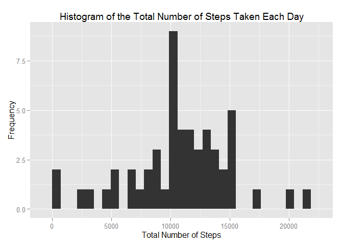
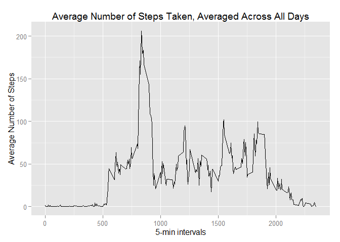
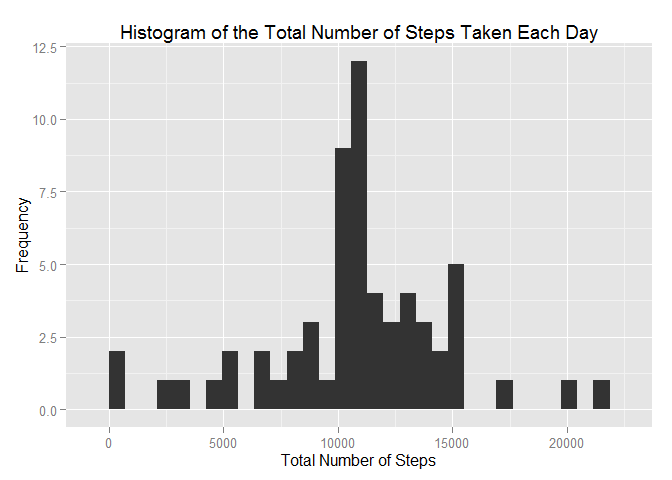

# Reproducible Research: Peer Assessment 1


## Loading and preprocessing the data

```r
library(dplyr)
library(ggplot2)
data<-read.csv(unzip("activity.zip"),colClasses = c("integer","Date","integer"))
#remove the NA value
completeData<-na.omit(data)
## What is mean total number of steps taken per day?
```

## What is mean total number of steps taken per day?
1. Calculate the total number of steps taken per day


```r
totalStep<-completeData%>%
  group_by(date)%>%
  summarise(total=sum(steps))
```

2. Make a histogram of the total number of steps taken each day


```r
g12<-ggplot(totalStep, aes(x=total))+geom_histogram()
g12+labs(title="Histogram of the Total Number of Steps Taken Each Day",
      x="Total Number of Steps",
      y="Frequency")
```

 

3. Calculate and report the mean and median of the total number of steps taken per day


```r
mean(totalStep$total)
```

```
## [1] 10766.19
```

```r
median(totalStep$total)
```

```
## [1] 10765
```

## What is the average daily activity pattern?
1. Make a time series plot (i.e. type = "l") of the 5-minute interval (x-axis) and the average number of steps taken, averaged across all days (y-axis)


```r
fiveMin<-completeData%>%
  group_by(interval)%>%
  summarise(average=mean(steps))
g21<-ggplot(fiveMin, aes(x=interval,y=average))+geom_line()
g21+labs(x= "5-min intervals", y="Average Number of Steps", title="Average Number of Steps Taken, Averaged Across All Days")
```

 

2. Which 5-minute interval, on average across all the days in the dataset, contains the maximum number of steps?


```r
fiveMin$interval[which.max(fiveMin$average)]
```

```
## [1] 835
```

## Imputing missing values
1. Calculate and report the total number of missing values in the dataset


```r
#number of rows with NA
-sum(complete.cases(data)-1)
```

```
## [1] 2304
```

2. Devise a strategy for filling in all of the missing values in the dataset. The strategy does not need to be sophisticated. For example, you could use the mean/median for that day, or the mean for that 5-minute interval, etc. Here, we fill the missing data with the mean for that 5-min interval.

```r
imputed<-data
for (i in 1:nrow(imputed)) {
    if (is.na(imputed$steps[i])) {
        imputed$steps[i] <- fiveMin[which(imputed$interval[i] == fiveMin$interval), ]$average
    }
}
```

3. Make a histogram of the total number of steps taken each day and Calculate and report the mean and median total number of steps taken per day. Do these values differ from the estimates from the first part of the assignment? What is the impact of imputing missing data on the estimates of the total daily number of steps?  
+ Histogram of total number of steps taken each day

```r
totalStepImputed<-imputed%>%
  group_by(date)%>%
  summarise(total=sum(steps))

g33<-ggplot(totalStepImputed, aes(x=total))+geom_histogram()
g33+labs(title="Histogram of the Total Number of Steps Taken Each Day",
      x="Total Number of Steps",
      y="Frequency")
```

 
+ Mean and median total number of steps taken per day

```r
mean(totalStepImputed$total)
```

```
## [1] 10766.19
```

```r
median(totalStepImputed$total)
```

```
## [1] 10766.19
```

+ Compare them with the two before imputing missing data  
old mean and median

```
## [1] "oldMean= 10766.1886792453"
```

```
## [1] "oldMedian= 10765"
```
new mean and median

```
## [1] "newMean= 10766.1886792453"
```

```
## [1] "newMedian= 10766.1886792453"
```

So, after filling the missing data data, the new mean is the same as the old mean; the new median greater than the old median.

## Are there differences in activity patterns between weekdays and weekends?
1. Create a new factor variable in the dataset with two levels - "weekday" and "weekend" indicating whether a given date is a weekday or weekend day.

```r
data$dayOfWeek<-ifelse(as.POSIXlt(data$date)$wday==0 | as.POSIXlt(data$date)$wday==6, "weekend", "weekday")
head(data)
```

```
##   steps       date interval dayOfWeek
## 1    NA 2012-10-01        0   weekday
## 2    NA 2012-10-01        5   weekday
## 3    NA 2012-10-01       10   weekday
## 4    NA 2012-10-01       15   weekday
## 5    NA 2012-10-01       20   weekday
## 6    NA 2012-10-01       25   weekday
```

2. Make a panel plot containing a time series plot (i.e. type = "l") of the 5-minute interval (x-axis) and the average number of steps taken, averaged across all weekday days or weekend days (y-axis).


